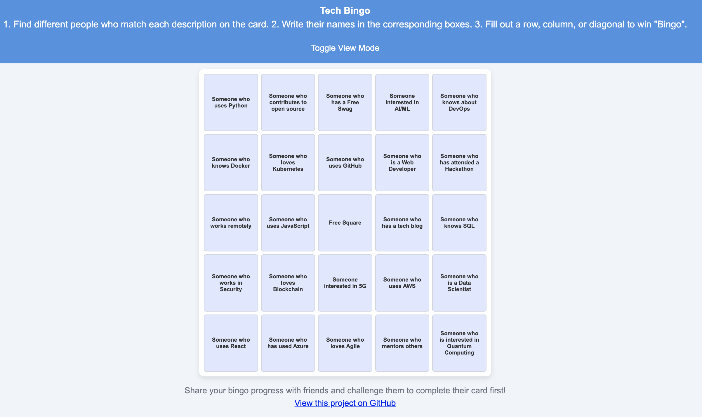

# Tech Networking Bingo

Welcome to **Tech Networking Bingo**! This web app is a fun, interactive game designed for tech meetups, networking events, and conferences. The goal is to find people who match each description on the bingo card, write their names in the boxes, and try to complete a row, column, or diagonal to win "Bingo."

## Overview

Tech Networking Bingo is a single-page, responsive web application where participants can engage with each other through a bingo game. Each bingo card contains prompts like "Someone who uses Python" or "Someone interested in AI/ML." This project is open-source, so feel free to contribute and add more fun features!

## Features

- **5x5 Bingo Grid**: Interactive grid with clickable items.
- **Dark Mode Toggle**: Users can switch between light and dark themes with an icon.
- **Add Names**: Allows users to add the names of people they meet.
- **Responsive Design**: Works well on mobile devices for ease of use at events.

---

## Demo

You can try the app [here](https://bingo.leeweijuin.com) (replace with a demo link if available).

